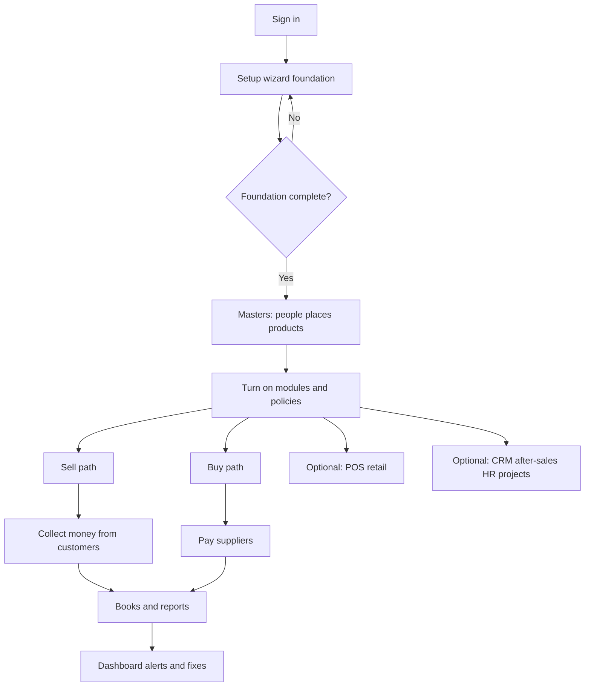
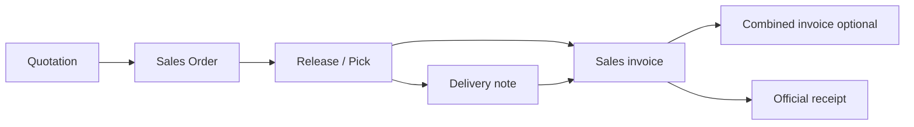
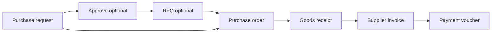

# Company journey — start to finish (plain language)

**Audiences:** product owner, superadmin, developer  
**Evidence:** setup wizard help, onboarding playbook, process policies ADR, golden demos, module APIs  
**Rule:** Plain words first; glossary only at the end.

---

## Big picture (one diagram)

---

## Act 0 — Sign in

1. Open the app and sign in (Google for real companies, or Try free demo).  
2. One email belongs to one company workspace.  
**Observed:** README quick start; help “Getting started”.

---

## Act 1 — Foundation (must finish before real trading)

Until foundation is complete, the server **blocks new selling and buying documents**.

**Required wizard steps** (order matters):

1. **Company** — legal name / branding → Confirm  
2. **Chart of accounts** — review seeded accounts → Looks good  
3. **Currency & tax** — PHP / VAT types → Confirm  
4. **Process policies** — decide skip-friendly vs strict → Confirm  
5. **Location** — Main warehouse/branch → Confirm  
6. **Partners** — at least one customer or supplier  
7. **Products** — at least one item (turn on serial tracking if you scan units)

**Who:** owners and store admins. Invited members see setup in progress but cannot finish it.

**Paths:** `/app/setup` · Dashboard “Start here” · `/app/dashboard/onboarding`

**Observed:** `documentationSections.ts` (`setup-wizard`); `setupreadiness` foundation gate.

---

## Act 2 — First week playbook (tracked onboarding)

| Week | Focus | What “done” looks like |
|------|-------|------------------------|
| 1 | Foundation & admin | Policies reviewed; modules enabled; optional migration |
| 2 | Selling & stock | Quote → order → pick → invoice → customer payment |
| 3 | Buying & accounts | Request → order → receive → supplier bill → pay |
| 4 | POS & operations | Shift open → checkout → close; CRM/after-sales as needed |

**Observed:** `onboardingPlaybookData.ts`; help `first-week`.

---

## Act 3 — Sell something (happy path)

Plain chain:

1. **Quotation** — offer a price to a customer  
2. **Sales Order** — customer accepts; you commit to deliver  
3. **Pick / Release** — take stock for the order (or reserve it, depending on policy)  
4. **Delivery note** (optional / policy) — prove what left the warehouse  
5. **Sales invoice** — bill the customer  
6. **Combined invoice** (optional) — group several bills  
7. **Official receipt** — record customer payment  

### Statuses you will see (Observed)

| Document | Progress / status values |
|----------|--------------------------|
| Quotation | `unconfirmed` → `in_progress` → `completed`; conversion `voucher_status`: `none` / `partial` / `completed` |
| Sales Order | `unconfirmed` / `in_progress` / `completed`; fulfillment `none` / `partial` / `completed` |
| Delivery note | `draft` → `posted` |
| Sales invoice | `unconfirmed` → submit → `e_approval` → approve → `completed` (or reject back) |
| Combined invoice | `unconfirmed` / `e_approval` / `confirmed` / `cancelled` |

### Important gate (easy to miss)

Creating a sales invoice **from a sales order** requires the sales order progress to be **`completed`**. “In progress” is not enough.  
**Observed:** sales integration / docflow.

### Stock behavior fork

| Policy `legacy_combined_so_release` | What release does | What invoice checks |
|-------------------------------------|-------------------|---------------------|
| `true` (default) | Lowers on-hand stock | Released minus already invoiced |
| `false` | Reserves stock | Delivered minus invoiced (after delivery note posts) |

**Observed:** ADR 0005; sales-order README.

### Proven demos

- **S2** serial buy→sell  
- **S4** direct invoice (skip order)  
- **S9** order → delivery → invoice  

---

## Act 4 — Buy something (happy path)

Plain chain:

1. **Purchase request** — ask to buy  
2. **Approve** (if policy) — manager says yes  
3. **RFQ / supplier quote** (optional) — shop vendors  
4. **Purchase order** — order from supplier  
5. **Goods receipt** — receive into stock (scan serials/lots if needed)  
6. **Supplier invoice** — supplier bill  
7. **Payment voucher** — pay the supplier  

### Statuses (Observed)

| Document | Values |
|----------|--------|
| Purchase request | `unconfirmed` → `e_approval` → `confirmed` (+ `in_progress` / `completed`); send `unsent` / `sent` |
| Purchase order | `draft` → `confirmed` → `partially_received` / `received` / `cancelled` |
| RFQ | `draft` / `sent` / `closed` / `cancelled` |
| Supplier quotation | `draft` / `received` / `accepted` / `rejected` |
| Goods receipt | `draft` → `posted` (reverse → `cancelled`) |
| Payment / receipt reports | `none` / `partial` / `full` |

### Proven demos

- **S3** lot receive → direct sales invoice  
- **S8** partial supplier payment  
- **S10** purchase request approval → purchase order  

---

## Act 5 — Retail counter (POS)

1. Enable POS module  
2. **Manage** — configure (managers)  
3. **Open shift** — location + opening cash  
4. Sell / hold bills → **Checkout** (creates sales invoice + reduces stock)  
5. **Close shift** — count cash / variance  

**Gates:** foundation complete; stock available; serial items need one serial per unit.

**Observed:** help POS sections / KB articles. Exact DB shift enum: **UNKNOWN** (see gap register).

---

## Act 6 — Money and books

| Job | Where |
|-----|-------|
| Record customer payment | Accounting → Receipts / Receivables (`finance.acct_ii`) |
| Pay supplier | Accounting → Vouchers / Payables |
| Journals / trial balance / P&L | Accounting → Bookkeeping / Ledger (`finance.acct_i`) |
| Taxes | Accounting → Taxes sub-branch (tax types under Quotation path) |
| Budgets / statutory | Accounting → Budgets / BIR Statutory |

Journal entries: `draft` → `posted` (optional approval).  
**Observed:** finance README; process policy auto-post flags.

---

## Act 7 — Keep the business healthy

| Area | What people do |
|------|----------------|
| Home dashboard | KPIs, day jobs, red flags |
| Reports | Charts, catalog, saved views |
| CRM | Leads, follow-ups, warranty, quote board |
| After-sales | Repair orders, intake, parts, warranty |
| Quality | NCR, QC, CAPA (QC can hold a receipt) |
| Support | Tickets |
| Project Management | Work hub, job costing, automation |
| HR | Hire → attend → leave → payroll → remit |
| Stock depth | Serials, warehouse schedule, BOM/work orders |
| User Management | Users, roles, modules, policies, migration, demo data |
| Help / Baiko | Guides and assisted actions (Baiko never silent-writes ERP) |

---

## Act 8 — Fix gaps the dashboard shows

Red-flag themes (**Observed:** dashboard README):

- Low stock  
- Quotes expiring / not converted  
- Sales order not fully released  
- Reserved without delivery note  
- Delivered without invoice  
- Open purchase order not received  
- Goods received without supplier bill  
- Payment over-applied  
- Serial mismatches  

Owners use these as the daily “what is stuck?” list.

---

## Tiny glossary (only the words you cannot avoid)

| Word on screen | Plain meaning |
|----------------|---------------|
| Quotation | Price offer |
| Sales order | Promise to deliver |
| Release / pick list | Take (or reserve) stock for an order |
| Delivery note / receipt | Proof of delivery |
| Sales / SI | Customer invoice |
| Official receipt | Customer payment record |
| Purchase request | Internal ask to buy |
| Purchase order | Order to supplier |
| Goods receipt / purchase receive | Stock arrived |
| Supplier invoice | Bill from supplier |
| Payment voucher | Supplier payment record |
| Process policy | Company switch that tightens or relaxes steps |
| Feature code | Switch that shows/hides a licensed area |

---

## Owner decisions at the start

1. **Skip-friendly** (default): release lowers stock immediately; many “require X” policies off.  
2. **Strict:** turn on enforced gates you need (require quotation / sales order / delivery qty / GR before bill / JE approval). Treat PR/SO/PO “approval required” toggles as **advisory** until product re-enables them.  
3. **Serial business:** enable serial feature + track serial on items before first receive.  
4. **Who approves:** grant approve permissions for purchase requests and sales invoices.

Document the choices on Process Policies — that page is the control panel for Acts 3–4.
