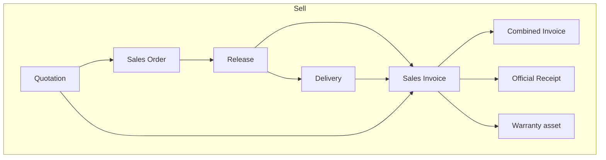
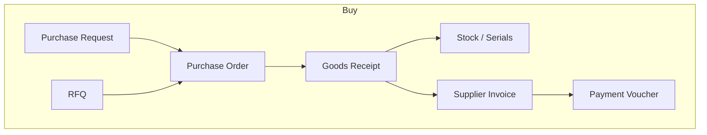

# Cross-module handoffs

**Purpose:** show how documents talk to each other — no jargon, fact-based.  
**Evidence:** module READMEs, ADR 0005, API integration handlers, golden demos.

---

## Selling spine

| From | To | What happens | Evidence |
|------|----|--------------|----------|
| Quotation | Sales Order | Order lines from quote; quote `voucher_status` updates | quotation + salesorder integration |
| Sales Order | Release / Pick | Stock down or reserved; fulfillment advances | salesorder releases |
| Release | Delivery note | Documentary (legacy) or issues stock (split mode) | deliveryreceipt |
| Sales Order (completed) | Sales invoice | Load Slip / open lines; SI must not exceed released or delivered qty | sales integration — **SO must be `completed`** |
| Quotation | Sales invoice | Possible Load Slip source | sales docs |
| Shipping order | Sales invoice | Possible Load Slip source | sales docs |
| Sales invoice | Combined invoice | Eligible when completed and not yet invoicing_status | collective invoicing |
| Sales invoice | Official receipt | Payment applications | finance |
| Sales invoice (serial + warranty) | CRM warranty asset | Created on sales | sales + crm |
| Sales Order lines | Purchase Request | Can load SO lines into a buy request | purchaserequest |
| Booking | Quotation | Convert booking → quotation (needs customer + tax/currency) | booking conflict/convert |
| Operations work item | Quotation | Create quotation from work item | operations README |

---

## Buying spine

| From | To | What happens | Evidence |
|------|----|--------------|----------|
| Purchase Request | Purchase Order | `from-purchase-request`; optional approval gate | PO confirm |
| RFQ / Supplier quote | Purchase Order | Optional vendor shopping | purchaseorder rfq |
| Purchase Order | Goods Receipt | Draft receive; scan serials/lots | goodsreceipt |
| Goods Receipt post | Stock / Serial registry | On-hand up; serials `in_stock` | serial-lot README |
| Goods Receipt | Supplier Invoice | Bill against posted GR balance when policy on | finance / policy |
| Supplier Invoice | Payment Voucher | Pay applications | finance |
| Goods Receipt (QC held) | — | Held inspection blocks GR post | quality / goods_receipts |
| Goods Receipt warranty | CRM | Warranty at receive (serial path) | serial-lot README |

---

## Stock & manufacturing

| From | To | Notes |
|------|----|-------|
| Masters (partners, items, locations) | All docs | Foundation for every commercial doc |
| Goods Receipt | Serial registry | Units appear `in_stock` |
| SO Release (split) | Serial | Units `reserved` |
| Sales invoice | Serial | Units `sold` |
| BOM | Work Order | Materials plan |
| Sales Order line | Work Order | Load Slip on New Work Order copies open SO lines (`source_sales_order_line_id`); MTO golden S14 |
| Work Order release → complete | Stock | Backflush materials + finished goods receive (`mfg_work_order` stock movements) |
| WMS scheduled receipt | Goods Receipt | Compare planned vs posted; variance/close |
| Repair order | Stock location | RMA hold → parts consumption → release to non-RMA |

---

## Money & books

| Event | Accounting effect (high level) |
|-------|--------------------------------|
| Completed sales invoice | Can create/sync journal (auto-post flag) |
| Official receipt | Applies to SI; receipt status none/partial/full |
| Supplier invoice | AP; optional JE |
| Payment voucher | Applies to supplier invoices |
| Payroll posted | Payslips → JE |
| Fixed assets | Register (deeper multi-book depreciation still roadmap) |

---

## People & control

| From | To | Notes |
|------|----|-------|
| User Management modules | Sidebar visibility | Tenant module & feature flags |
| Process Policies | All commercial gates | See policies page |
| Setup readiness | API POST block | Until foundation complete |
| Roles / permissions | Approve buttons | e.g. `sales.approve`, `purchase_request.approve` |
| Demo Data | Golden chains | Populate S2–S12 for training/QA |

---

## Non-posting helpers (do not change stock by themselves)

| Area | Touches commercial docs how |
|------|-----------------------------|
| CRM follow-ups / quote board | Reads quote/SO state; alerts |
| Communications | Email / chat share of saved docs |
| Support tickets | May link warranty / repair |
| Operations automation | Triggers on work item / quotation events |
| Help / Baiko | Guidance; Baiko approve path never silent ERP write |
| Activity logs | Audit trail |
| Data Center | Import → stage → post to live |
| Reports / BI | Read models |

---

## Policy forks that change handoffs

| Policy | Handoff change |
|--------|----------------|
| `legacy_combined_so_release = true` | Release → stock down; SI uses released−invoiced; DR mostly documentary |
| `legacy_combined_so_release = false` | Release → reserve; DR → stock down; SI uses delivered−invoiced |
| `sales_require_quotation` | SO create needs source quotation |
| `sales_require_so` | Blocks direct SI without SO-linked lines |
| `sales_require_delivery_receipt` | SI qty checked against delivered (**enforced** when on) |
| `purchase_require_pr` | PO needs PR |
| `purchase_require_gr_before_supplier_invoice` | Bill needs posted GR lines |
| `purchase_require_pr_approval` | **Advisory** — PO from Unconfirmed PR still allowed |
| `sales_require_so_approval` / `purchase_require_po_approval` | **Advisory** — do not block release/GR/bill today |

Full table: `05-PROCESS-POLICIES-AND-GATES.md`.
