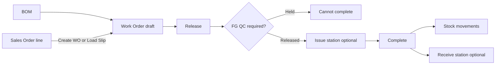

# Production module guide

Production (sidebar **Production**) covers in-house assembly, make-to-order (MTO), make-to-stock (MTS), and cut-apart (disassembly) with finished-goods QC. Nav labels use **Jobs (work orders)** and **Recipes (BOMs)**.

## Navigation

| Tab | Route | Purpose |
|-----|-------|---------|
| Jobs (work orders) | `/app/production/work-orders` | Draft → released → completed lifecycle; deep-links to stations |
| Recipes (BOMs) | `/app/production/boms` | Bills of material (assembly + cut-apart / disassembly) |
| Reports | `/app/production/reports` | Job status (incl. source SO), progress, and stock movement audit |
| Setup | `/app/production/setup` | FG QC + optional completed-WO release policy; link to Modules & Features |

Issue / Receive / Weigh stations remain valid URLs (`/app/production/issue-station`, `receive-station`) opened from a released job with `?woId=` (overflow, not primary tabs).

Enable under **User Management → Module & Features** (`manufacturing` module). Turn Manufacturing off if you only trade finished goods — Production nav is hidden. Permissions: `manufacturing.boms`, `manufacturing.work_orders`, `manufacturing.work_orders_release`, `manufacturing.work_orders_complete`, `manufacturing.boms_bulk`, `manufacturing.work_orders_bulk`, `quality.wo_inspection`.

**Costing:** Disassembly and assembly complete post **stock quantities (and lots)** only. There is **no carcass→cut cost allocation** on work-order complete until a future inventory costing project.

## Work order flow

1. **Create** — pick BOM, plant location, qty to produce. MTO: **Sales Order → Create work order(s)** or Production **Load Slip → Sales Order** sets `source_sales_order_id` / `source_sales_order_line_id`.
2. **Materials preview** — work order detail shows on-hand vs required (respects UoM conversion, scrap/spare qty, yield %).
3. **Release** — status `released`; records `released_at`. From the WO row, open **Issue materials** / **Receive FG** for tracked lines (`?woId=`).
4. **FG inspection** — default `released`; when **Process policies → Require FG QC** (or Production Setup) is on, new WOs start `pending` until Quality releases (`quality.wo_inspection`).
5. **Complete** — backflush (assembly) or consume input + receive outputs (disassembly). Sets `qty_produced`, `completed_at`, and optional `actual_input_qty` / `input_lot_batch_id`.

### BOM types

| Type | Finished item | Component lines | Complete behavior |
|------|---------------|-----------------|-----------------|
| `assembly` | Output SKU | Materials consumed | Issue components, receive finished item |
| `disassembly` | Input SKU (e.g. fabric roll) | Yield outputs | Consume input qty, receive component lines |

Disassembly supports yield variance via `actual_input_qty` on complete (golden **S16**).

## QC (finished goods)

Mirrors goods-receipt inspection:

- Fields: `inspection_status` (`pending` / `held` / `released`), notes, inspected timestamp.
- **Complete is blocked** until `inspection_status = released`.
- Opt-in policy: `tenant_process_policies.manufacturing_require_fg_qc` (migration 275).

Route: patch inspection on the work order from the Work Orders grid/modal (Quality permission).

## Serial / lot stations

For tracked components or finished goods:

| Station | When | API trace tables |
|---------|------|------------------|
| **Issue station** | After release, before complete | `mfg_wo_issue_serials`, `mfg_wo_issue_lots` |
| **Receive station** | After release, before complete (FG) | `mfg_wo_output_serials`, `mfg_wo_output_lots` |

Non-tracked items still backflush via qty-only `inv_stock_movements` (`wo_backflush_issue` / `wo_backflush_receipt` or disassembly equivalents).

Perishable catch-weight lots use the same lot staging pattern as Inventory Receive station; see `20-PERISHABLE-CATCH-WEIGHT.md`.

## Sales order ↔ Production

**Push (Sales):** On a saved sales order (list or modal), **Create work order(s)** calls `POST /manufacturing/work-orders/from-sales-order/{id}` when Manufacturing is enabled and the user has WO write. Lines need an active BOM.

**Pull (Production):** **New Work Order → Load Slip → Sales Order** lists open SO lines with balance qty (same API family as PR Load Slip).

Linked lines show **Making** (open WO qty) and **Made** (completed WO `qty_produced`) on the sales order line grid.

**Optional release bridge** (default **off**): `tenant_process_policies.sales_count_completed_wo_toward_release` (migration 276). When on, completed linked WO qty can floor SO release stock availability. Leave off for bit-identical legacy release math.

Golden **S14**: `DEMO-S14-SO` (item 00001 × 1) → `DEMO-S14-WO` completed, FG QC released.

## Reports

**Production → Reports** (`/app/production/reports`):

| Report | What it shows |
|--------|----------------|
| Work order status | Date range, status, inspection, SO link, qty produced |
| Work order progress | Progress %, staged serial/lot issue and output counts |
| Stock movements | Movements with `ref_type = mfg_work_order` |

CSV export follows the same list APIs as other module reports.

## Golden demo scenarios (S14–S17)

Seed: `scripts/seed-demo-golden-s14-s16-production.sql` and `scripts/seed-demo-golden-s17-meat-cut.sql` (after golden scenarios + inventory).

| Scenario | Doc nos | Story |
|----------|---------|-------|
| **S14 MTO** | `DEMO-S14-SO`, `DEMO-S14-WO`, `DEMO-S14-BOM` | SO line for Modular Sofa (00001) → completed WO with SO link |
| **S15 MTS** | `DEMO-S15-WO` | Completed WO, no SO link, same assembly BOM |
| **S16 Disassembly** | `DEMO-S16-WO`, `DEMO-S16-BOM` | Fabric (00004) disassembly with `actual_input_qty = 9.2` |
| **S17 Meat cut** | `DEMO-S17-*`, partners `M17A`/`M17B`, items `S17WH`/`S17BL`/`S17PT`/`S17RB` | Disassembly + catch-weight lots + pack/ship for Cust A + FEFO belly sale |

Verify: `scripts/verify-demo-full-chain.sql` (S14–S17 checks). Demo walkthrough: `21-PRODUCTION-S17-MEAT-DEMO.md`.

**Meat delivery unit (v1):** pack session on the customer sales order + shipping order — not a separate BOX master. One box → one customer.

Assembly BOM **DEMO-S14-BOM** at location **00002**: finished 00001 ← 00002×2 + 00003×1 + 00004×3.

## Phase 5 — deferred backlog

Not in current MVP; tracked in `docs/TIER_C_BACKLOG.md`:

| Item | Notes |
|------|-------|
| Partial complete | Today `qty_produced` always equals `qty_to_produce` on complete |
| Multi-level BOM | Single-level only (migration 080 + UoM/scrap) |
| Routing / work centers | No operation sequence or capacity planning |
| Component alternates | Fixed BOM lines only |
| Costing / WIP GL | Stock qty impact only; no WIP journals |
| Cancel from released | Cancel limited to draft |
| In-process QC | FG gate shipped; no operation-step QC or goods-issued doc |
| Production analytics charts | ECount-style progress dashboards still roadmap |

## Related docs

- Cross-module handoffs: `04-CROSS-MODULE-HANDOFFS.md` (SO→WO, WO→stock)
- Process policy FG QC: `05-PROCESS-POLICIES-AND-GATES.md`
- Perishable / disassembly Phase 3: `20-PERISHABLE-CATCH-WEIGHT.md`
- ECount production report gap audit: `docs/ecount-audit/screens/inv1-reports-production.md`
