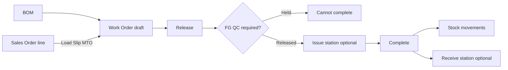

# Production module guide

Production (sidebar **Production**) covers in-house assembly, make-to-order (MTO), make-to-stock (MTS), and disassembly with finished-goods QC.

## Navigation

| Tab | Route | Purpose |
|-----|-------|---------|
| Workspace | `/app/production` | KPI shortcuts into BOMs, work orders, and reports |
| BOMs | `/app/production/boms` | Bills of material (assembly + disassembly) |
| Work Orders | `/app/production/work-orders` | Draft → released → completed lifecycle |
| Issue station | `/app/production/issue-station` | Stage serial/lot component issues before complete |
| Receive station | `/app/production/receive-station` | Register serial/lot finished goods before complete |
| Reports | `/app/production/reports` | WO status, progress, and stock movement audit |

Enable under **User Management → Module & Features** (`manufacturing` module). Permissions: `manufacturing.boms`, `manufacturing.work_orders`, `manufacturing.work_orders_release`, `manufacturing.work_orders_complete`, `quality.wo_inspection`.

## Work order flow

1. **Create** — pick BOM, plant location, qty to produce. Optional **Load Slip → Sales Order** sets `source_sales_order_line_id` (MTO).
2. **Materials preview** — work order detail shows on-hand vs required (respects UoM conversion, scrap/spare qty, yield %).
3. **Release** — status `released`; records `released_at`.
4. **FG inspection** — default `released`; when **Process policies → Manufacturing require FG QC** is on, new WOs start `pending` until Quality releases (`quality.wo_inspection`).
5. **Complete** — backflush (assembly) or consume input + receive outputs (disassembly). Sets `qty_produced`, `completed_at`, and optional `actual_input_qty` / `input_lot_batch_id`.

### BOM types

| Type | Finished item | Component lines | Complete behavior |
|------|---------------|-----------------|-----------------|
| `assembly` | Output SKU | Materials consumed | Issue components, receive finished item |
| `disassembly` | Input SKU (e.g. fabric roll) | Yield outputs | Consume input qty, receive component lines |

Disassembly supports yield variance via `actual_input_qty` on complete (golden **S16**).

## QC (finished goods)

Mirrors goods-receipt inspection:

- Fields: `inspection_status` (`pending` / `held` / `released`), notes, inspected timestamp.
- **Complete is blocked** until `inspection_status = released`.
- Opt-in policy: `tenant_process_policies.manufacturing_require_fg_qc` (migration 275).

Route: patch inspection on the work order from the Work Orders grid/modal (Quality permission).

## Serial / lot stations

For tracked components or finished goods:

| Station | When | API trace tables |
|---------|------|------------------|
| **Issue station** | After release, before complete | `mfg_wo_issue_serials`, `mfg_wo_issue_lots` |
| **Receive station** | After release, before complete (FG) | `mfg_wo_output_serials`, `mfg_wo_output_lots` |

Non-tracked items still backflush via qty-only `inv_stock_movements` (`wo_backflush_issue` / `wo_backflush_receipt` or disassembly equivalents).

Perishable catch-weight lots use the same lot staging pattern as Inventory Receive station; see `20-PERISHABLE-CATCH-WEIGHT.md`.

## Sales order Load Slip

**New Work Order → Load Slip → Sales Order** lists open SO lines with balance qty. Selecting a line:

- Creates a work order linked via `source_sales_order_id` and `source_sales_order_line_id`.
- Doc generation rule seeds: `Default SO to Work Order` (migration 274).

Golden **S14**: `DEMO-S14-SO` (item 00001 × 1) → `DEMO-S14-WO` completed, FG QC released.

## Reports

**Production → Reports** (`/app/production/reports`):

| Report | What it shows |
|--------|----------------|
| Work order status | Date range, status, inspection, SO link, qty produced |
| Work order progress | Progress %, staged serial/lot issue and output counts |
| Stock movements | Movements with `ref_type = mfg_work_order` |

CSV export follows the same list APIs as other module reports.

## Golden demo scenarios (S14–S16)

Seed: `scripts/seed-demo-golden-s14-s16-production.sql` (after golden scenarios + inventory).

| Scenario | Doc nos | Story |
|----------|---------|-------|
| **S14 MTO** | `DEMO-S14-SO`, `DEMO-S14-WO`, `DEMO-S14-BOM` | SO line for Modular Sofa (00001) → completed WO with SO link |
| **S15 MTS** | `DEMO-S15-WO` | Completed WO, no SO link, same assembly BOM |
| **S16 Disassembly** | `DEMO-S16-WO`, `DEMO-S16-BOM` | Fabric (00004) disassembly with `actual_input_qty = 9.2` |

Verify: `scripts/verify-demo-full-chain.sql` (S14–S16 checks before final notice).

Assembly BOM **DEMO-S14-BOM** at location **00002**: finished 00001 ← 00002×2 + 00003×1 + 00004×3.

## Phase 5 — deferred backlog

Not in current MVP; tracked in `docs/TIER_C_BACKLOG.md`:

| Item | Notes |
|------|-------|
| Partial complete | Today `qty_produced` always equals `qty_to_produce` on complete |
| Multi-level BOM | Single-level only (migration 080 + UoM/scrap) |
| Routing / work centers | No operation sequence or capacity planning |
| Component alternates | Fixed BOM lines only |
| Costing / WIP GL | Stock qty impact only; no WIP journals |
| Cancel from released | Cancel limited to draft |
| In-process QC | FG gate shipped; no operation-step QC or goods-issued doc |
| Production analytics charts | ECount-style progress dashboards still roadmap |

## Related docs

- Cross-module handoffs: `04-CROSS-MODULE-HANDOFFS.md` (SO→WO, WO→stock)
- Process policy FG QC: `05-PROCESS-POLICIES-AND-GATES.md`
- Perishable / disassembly Phase 3: `20-PERISHABLE-CATCH-WEIGHT.md`
- ECount production report gap audit: `docs/ecount-audit/screens/inv1-reports-production.md`
