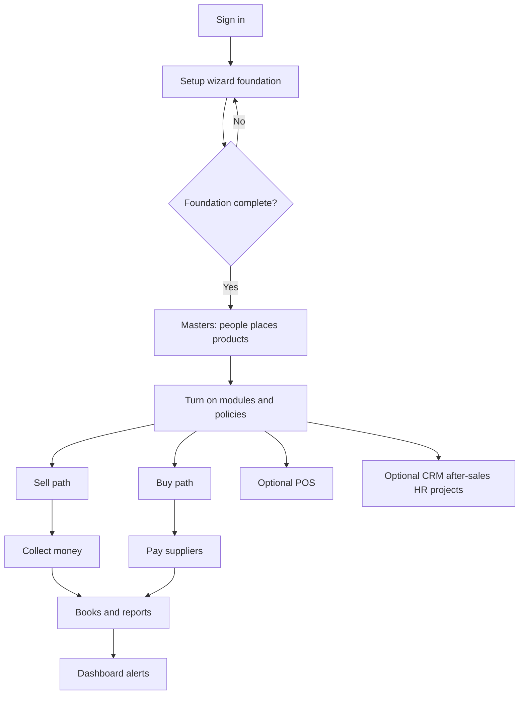
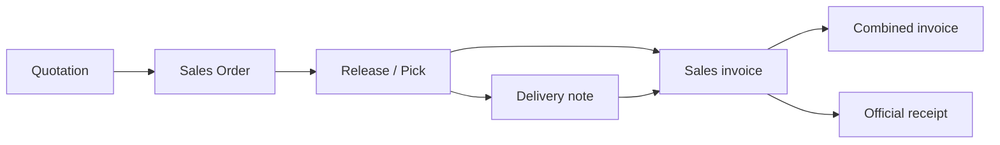
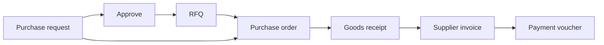
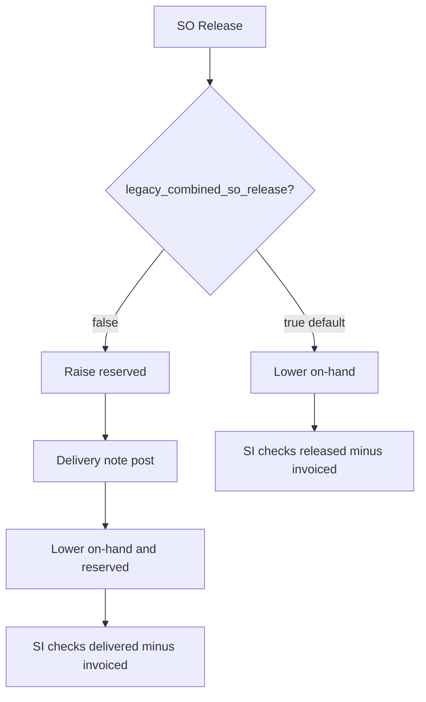

# Diagrams (Mermaid source)

Notion does not render Mermaid. Export PNG from [mermaid.live](https://mermaid.live) and embed, or keep as code for developers.

## 1. Company big picture

## 2. Sell spine

## 3. Buy spine

## 4. Release mode fork

