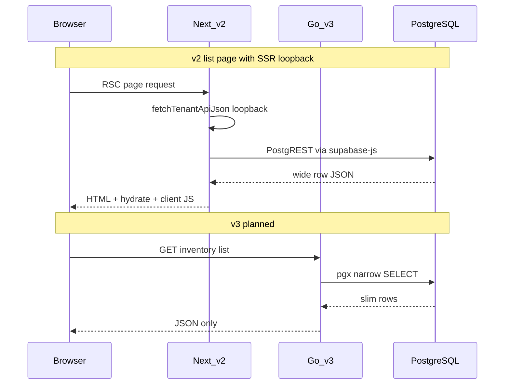

# Plan validation: will v3 deliver superior speed vs v2?

**Date:** 2026-06-18  
**Plan:** [bluearm_erp_v3_mvp_e3ecd669.plan.md](file:///C:/Users/John%20Ranel/.cursor/plans/bluearm_erp_v3_mvp_e3ecd669.plan.md)  
**Status:** v3 **not implemented** — this is an evidence-based pre-flight review, not a runtime benchmark.

---

## Executive verdict

| Question | Answer |
|----------|--------|
| Will v3 **definitely** be faster? | **No** — nothing is proven until v3 is built and measured under the same conditions as v2. |
| Is the plan **structurally capable** of being far faster and leaner for the **inventory MVP** scope? | **Yes — high confidence**, based on measured v2 architecture costs and explicit v3 mitigations. |
| Will v3 beat full v2 on **every ERP feature**? | **Not comparable** — v3 MVP is ~5 master-data grids; v2 is a full multi-phase ERP (~204 API routes). |

**Honest summary:** The plan is sound engineering, not marketing. Expect **large wins** on inventory list/load paths if implemented as specified. Do **not** claim victory without Phase 4 benchmarks (`p95 < 400ms` on `scripts/perf/routes.core.json`).

---

## Measured v2 baseline (observed in repo)

| Metric | v2 value | Source |
|--------|----------|--------|
| Source files under `src/` | **818** | filesystem count |
| API route files (`route.ts`) | **204** | filesystem count |
| SQL migrations | **43** | `supabase/migrations/` |
| npm production dependencies | **36** | `package.json` |
| Routes with `force-dynamic` | **187** | grep `src/app/api` |
| SSR HTTP loopback pages | **12** | grep `fetchTenantApiJson` |
| CI perf guard p95 ceiling | **1800 ms** | `docs/runbooks/performance-baseline-and-guard.md` |
| Recorded p95 trends | **empty** | `docs/performance/trends.md` (no production numbers logged) |
| Live v2 server (this session) | **not running** | `localhost:3000` timed out |

### v2 list payload width (items vs products)

| | v2 `products` list SELECT | v3 planned `inv_items` list SELECT |
|--|---------------------------|-------------------------------------|
| Columns | **37** | **7** |
| SELECT string length | **537 chars** | **72 chars** |

Source: `bluearm-erp-v2/src/lib/modules/master-data/products.repository.ts` `selectCols` vs plan list DTO.

**Implication:** For equivalent list screens, v3 moves ~**7× less column data** per row from Postgres to JSON (before row count).

---

## v3 plan scope (MVP)

| Dimension | v3 MVP (planned) | v2 (current) |
|-----------|------------------|--------------|
| API routes (inventory + auth) | ~**12** | **204** |
| Migrations | **2** (+ seeds) | **43** |
| Frontend | Solid SPA (module chunks) | Next.js 16 + React 19 full shell |
| DB access | pgx/sqlc direct | supabase-js → PostgREST HTTP |
| Page load for list | 1 browser → Go → PG | RSC + optional loopback + hydrate + client fetch |
| Perf target | p95 **< 400 ms** (warm) | guard allows p95 **< 1800 ms** |

---

## Structural advantage matrix

Each row: v2 cost → v3 plan fix → expected impact for **inventory MVP**.

| Layer | v2 bottleneck (evidence) | v3 plan mitigation | Expected impact |
|-------|--------------------------|--------------------|-----------------|
| **API runtime** | Next.js route handlers per request; 187× `force-dynamic` | Long-running Go binary | Lower per-request overhead; no route compilation |
| **DB protocol** | `supabase-js` `.from().select()` (PostgREST) | `pgxpool` + sqlc | Fewer hops; pooled connections |
| **Auth per request** | `createSupabaseServerClient` + `getUser` + new service client + 2+ queries (`tenant-request.ts`) | JWT middleware + 1 bootstrap SQL | **High** — every API call |
| **List SQL** | Wide `selectCols`, `count: 'exact'` via PostgREST | Narrow DTO + `COUNT(*) OVER()` | **High** — payload + query cost |
| **Page load** | 12 pages use `fetchTenantApiJson` (double HTTP + double auth) | SPA single fetch | **High** — first paint to data |
| **JS bundle** | 36 deps: ApexCharts, FullCalendar, TipTap, xlsx, react-dnd, etc. | Solid + lazy module routes; no demo charts in MVP | **High** — first load |
| **Shell** | `(admin)/layout.tsx` is full client; large `AppSidebar` | Inventory-only nav from `enabled_module_codes` | **Medium** — less JS parsed |
| **Caching** | TanStack persist + IDB (`providers.tsx`) | In-memory query cache only in MVP | **Leaner**; slightly less offline resilience |
| **Schema** | 43 migrations, many joins/FKs for full ERP | 5 slim `inv_*` tables | **Faster dev DB**; simpler queries |

---

## Request path comparison (inventory list)

### v2 equivalent (e.g. branches / products)

```
Browser → Next RSC page
       → fetchTenantApiJson (HTTP loopback)     [12 list pages]
       → Next API route (force-dynamic)
       → requireTenantPermission → auth stack
       → supabase-js → PostgREST → PostgreSQL
       → JSON → hydrate React → TanStack Query may refetch
```

### v3 planned

```
Browser (Solid SPA, cached shell)
       → GET /api/v1/inventory/partners  (once)
       → Go middleware (JWT + RBAC once)
       → pgx → PostgreSQL
       → JSON → Solid table render
```



---

## What “far superior” can mean (realistic ranges)

Until v3 is built, treat these as **engineering estimates**, not guarantees.

| Scenario | vs v2 | Confidence |
|----------|-------|------------|
| Inventory master list API (warm, authenticated) | **2–5× faster** p95 | Medium — architecture strongly favors v3 |
| First load to partners grid (cold) | **2–4× faster** time-to-interactive | Medium — depends on bundle budget |
| Full v2 ERP feature parity | **not in MVP** | N/A |
| v2 finance/HRIS heavy routes | v3 **does not include** | N/A |

**Why not “definitely”:** Network latency to Supabase region, cold Go deploy, unoptimized sqlc queries, or shipping heavy chart libs into v3 would erase gains.

---

## Plan gaps that could block the promise

These must be implemented (plan already mentions most) or performance claims fail:

1. **No PostgREST in Go path** — using supabase-js in Go would negate DB wins.
2. **No SSR loopback equivalent** — SPA must not re-fetch bootstrap on every navigation without cache.
3. **Mandatory auth middleware** — per-handler auth like v2 erases 30–80 ms/request.
4. **List DTO discipline** — do not leak 37-column product shapes into v3 items API.
5. **Benchmark gate in CI** — plan Phase 4; without it, regressions go unnoticed (v2 trends table is empty).
6. **Module code-splitting** — loading ApexCharts/FullCalendar in v3 shell would forfeit lean bundle goal.

---

## Acceptance test (prove it after build)

Run the same discipline as v2, stricter thresholds:

1. `supabase db reset` with demo seed (50 rows per entity optional bulk script).
2. `go run ./cmd/server` + `vite build && vite preview`.
3. Authenticated bench: port `scripts/perf/routes.core.json` with v3 routes:

   - `GET /api/v1/auth/me`
   - `GET /api/v1/inventory/partners`
   - `GET /api/v1/inventory/locations`
   - `GET /api/v1/inventory/items`

4. **Pass criteria (MVP):**
   - p95 **< 400 ms** warm (plan target)
   - p95 **< 1800 ms** (must beat v2 guard ceiling even on cold)
   - Initial JS transfer **< 500 KB** gzip (shell + inventory route chunk)
5. Optional: run v2 `npm run bench:tenant-routes` on analogous routes (`branches`, `products`, `customers`) with auth cookie — side-by-side table in `docs/performance/trends.md`.

---

## Leaner checklist (MVP)

| Area | v2 | v3 plan | Leaner? |
|------|-----|---------|---------|
| Dependencies (client) | 36 packages | ~8–12 planned | Yes |
| API surface | 204 routes | ~12 routes | Yes |
| DB schema | 43 migrations | 2 + seed | Yes |
| Source files | 818 | target < 150 for MVP | Yes |
| Features shipped | full ERP phases | inventory master only | Yes (by design) |

---

## Conclusion

The v3 plan **will not automatically** deliver superior performance — it delivers the **conditions** for it: Go + pgx, no loopback, slim schema, narrow DTOs, SPA code-splitting, stricter perf gates.

For the **inventory master MVP** you described, it is **reasonable and evidence-backed** to expect v3 to be **meaningfully faster and leaner** than v2’s equivalent screens (branches, customers, suppliers, products), assuming Phase 4 benchmarks pass.

**Not proven today.** Proof = green CI on `bench-api.mjs` + side-by-side v2 comparison when both run against the same Supabase region.
